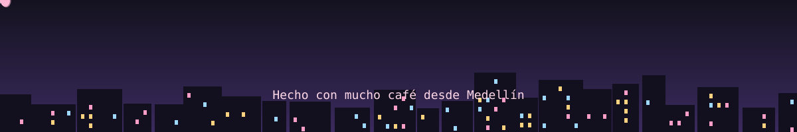

## `$ whoami`

## `$ cat tech-stack.yaml`

**Lenguajes y frameworks**

**Datos, backend y despliegue**

**Automatización y herramientas**

## `$ git log --pinned`

| Proyecto | Descripción |
|---|---|
| [**territorio-inn-2026-manrique**](https://github.com/Luis-Vanegas/territorio-inn-2026-manrique) | Propuesta para la convocatoria Territorio INN 2026 (Comuna 3 - Manrique) |
| [**mi-portafolio**](https://github.com/Luis-Vanegas/mi-portafolio) | Mi portafolio personal |
| [**Proyectos_sociales**](https://github.com/Luis-Vanegas/Proyectos_sociales) | Indicadores y datos de proyectos sociales |

## `$ github --stats`

## `$ connect --socials`

